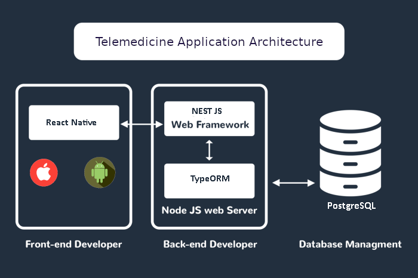
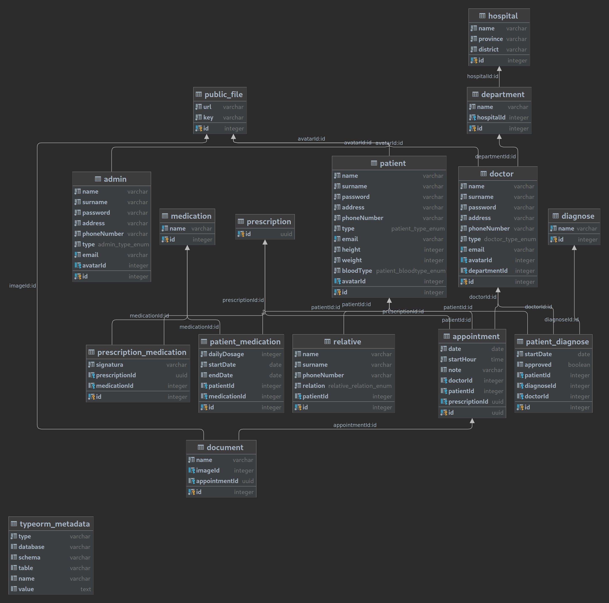
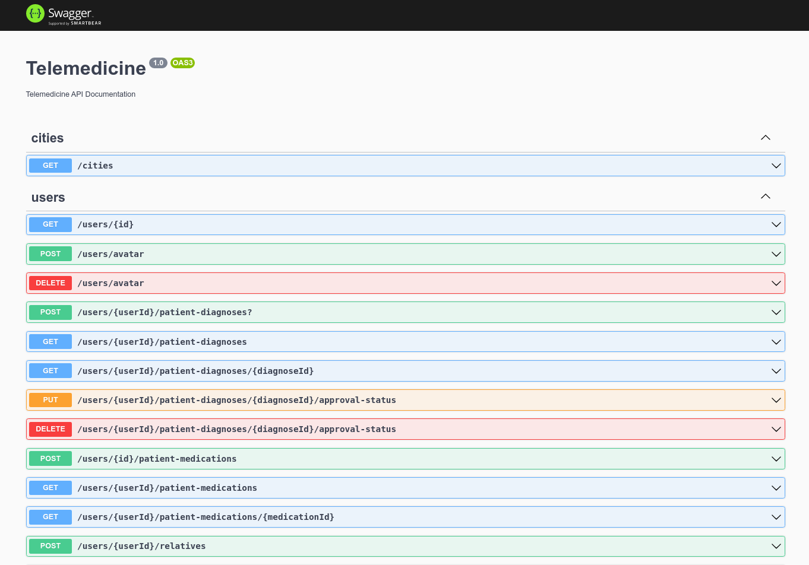

# Telemedicine

## Description

[Telemedicine](https://github.com/cico643/telemedicine) is a fully-fledged full-stack web application that serves certain medical services including booking an appointment, past medication use, hospital-department services, and much more for patients and doctors.

> **Note**: In this Readme, only the Server-side API will be covered since the client-side of the project has only been wrapped up for testing and improving the server-side. Although the client-side codes can work in production, It includes repetitive and sloppy codes in some places which I strongly discourage. On the other hand, the server-side was tried to be brought together with care and best practices so I would love to hear your opinions and valuable suggestions.

<br>
<br>

<p align="center">
    
</p>

## Backend API

For the backend API, a monolithic nestjs application has been put together along with Postgresql, TypeORM, Amazon S3 Bucket, Redis(as session cache). REST API conventions were followed throughout the application.

### Database Diagram

<p align="center">
    
</p>

### File Storage

To store files for patient documents and user avatars, [Amazon S3 Bucket](https://aws.amazon.com/s3/?nc1=h_ls) has been used which is an external provider.

### API Documentation

A Swagger UI has been implemented to facilitate the inspection of the API. After running the server, you can reach out to it with a get request to **/api** route.

<p align="center">
    
</p>

### Caching

There are 2 types of caching mechanisms implemented for the API. First, the redis client stores all about the users' session information.

And the second one is to cache cities provider of the API. Since the province and district information are not expected to change so quickly, the response of the cities controller will always be cached for 8 hours of time.

### Logging

In the development stages, 2 types of logging features have been implemented.

- The first one is a logger middleware to automatically log all the HTTP requests that come to our server. If we only want to log requests that pass our AuthGuard, we also might want to change our middleware implementation with an interceptor. Due to the request lifecycle of nestjs, interceptors will stand behind the guards.

- The second one is a custom logger that can manually log valuable information on the application runtime (e.g. DML query commit), to the standard output with desired log level. This logger has been implemented using WinstonModule as the default logger and is widely used around the application to help understand app status when running on the production environment. You can reach it from the `server/src/lib/logger.ts` file.

## Installation

Run the yarn command to install dependencies.

```bash
$ yarn
```

Make sure to have docker and docker-compose installed in your system.

Before running up the server, environment variables also need to be defined. To do this, create `.env.dev`, `.env.production`, `.env.test` files in the root directory of the **server/** folder. Inside these files, many different environment variables need to be defined including your AWS access keys for the S3 bucket. You can check the `.env.example` file as a reference for the required variables.

> **Note**: By creating the `.env.test` file, you will be able to run your tests on a different database instance.

## Running up the docker-compose file

To use a database and redis instances locally for development purposes, a docker-compose.yml has defined to run Postgresql, PgAdmin(Database Monitoring) and Redis.

```bash
$ cd server/ && docker-compose up
```

## Running the app

```bash
# development
$ cd server/ && yarn run start

# watch mode
$ cd server/ && yarn run start:dev

# production mode
$ cd server/ && yarn run start:prod
```

## Test

```bash
# unit tests
$ yarn run test

# e2e tests
$ yarn run test:e2e

# test coverage
$ yarn run test:cov
```

> Some unit tests for users service are wrapped up in the `users.service.spec.ts` file including mocking methods.

> Some e2e tests are written inside the `auth.e2e-spec.ts` file under the **test** directory to test authentication (signup, signin, signout) features of the app.
